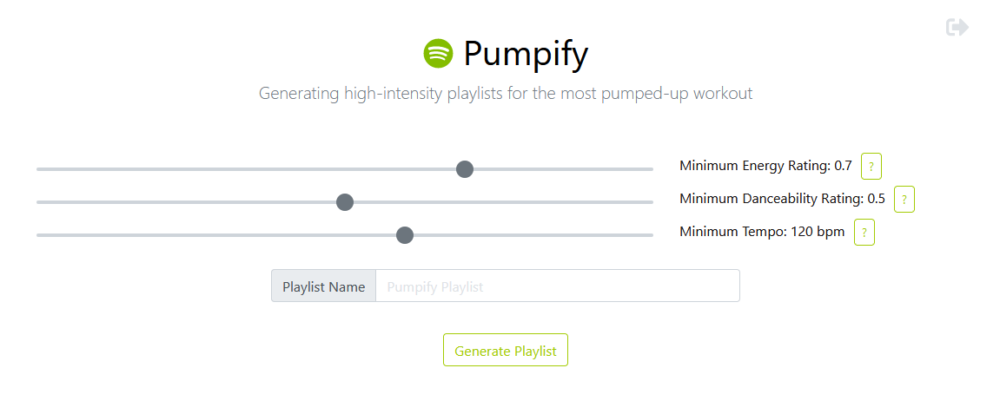

Pumpify reads through your entire Saved/Liked songs library on Spotify and adds every song that meets minimum energy, danceability, and tempo requirements.

## Usage

1. Fire up [the app](https://achapcomputing.github.io/pumpify/)
2. Click 'Get Started'
3. Grant Exportify access to your playlists
4. Adjust the sliders to the desired filter values
5. Enter desired playlist name
6. Click 'Generate Playlist'

Generating the playlist may take a while when the Liked Songs library is large. Clicking 'Playlist Created!' will open the new playlist with the 
filtered songs.

**No data will be saved - the entire application runs in the browser.**

## Development

This project was forked from [Exportify](https://github.com/watsonbox/exportify) for the authentication and authorization processes on Github Pages.

This project was bootstrapped with [Create React App](https://github.com/facebook/create-react-app).

In the project directory, first run `yarn install` to set up dependencies, then you can run:

**`yarn start`**

Runs the app in the development mode.\
Open [http://localhost:3000](http://localhost:3000) to view it in the browser.

The page will reload if you make edits.\
You will also see any lint errors in the console.

**`yarn test`**

Launches the test runner in the interactive watch mode.\
See the section about [running tests](https://facebook.github.io/create-react-app/docs/running-tests) for more information.

**`yarn build`**

Builds the app for production to the `build` folder.

### Stack

In addition to [Create React App](https://github.com/facebook/create-react-app), the application is built using the following tools/libraries:

* [React](https://reactjs.org/) - A JavaScript library for building user interfaces
* [Bootstrap 4](https://getbootstrap.com/) - styling and UI components
* [Font Awesome 5](https://fontawesome.com/) - vector icon set and toolkit
* [React Testing Library](https://testing-library.com/docs/react-testing-library/intro/) - light-weight solution for testing React DOM nodes
* [MSW](https://mswjs.io/) - network-level request mocking (more of my own thoughts [here](https://watsonbox.github.io/posts/2020/11/30/discovering-msw.html))
